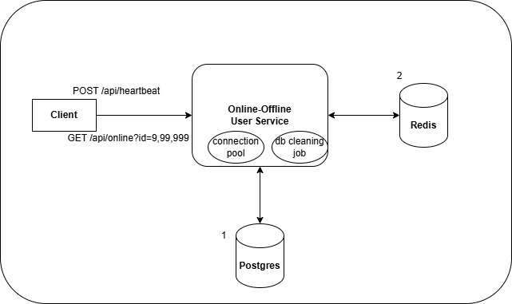

[Online offline users system design]

Flow:
1. Clients send periodic heartbeat, which updates their current online status.
2. Heartbeat updates goes postgres DB or redis (one storage system can be used). If database is used, a periodic cleanup job runs which delete rows which has passed online TTL.
3. If redis is used, online TTL is set as the expiry time for the users heartbeat signals.
